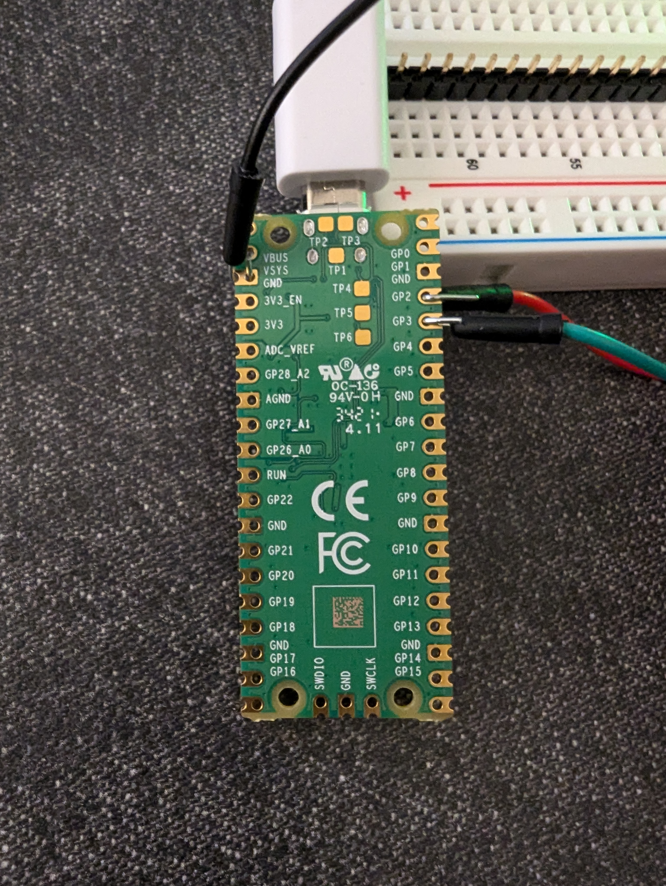

## BLT Tech Challenge
- By: Tahmid Kazi
- Date: Jan 12th, 2025

This is my submission for the BLT Tech Challenge. 

#### Hardware and Installation Instructions:
##### Hardware and Video Link:

I used the Raspberry Pi Pico (RP2040) and its C/C++ SDK as my platform of choice. I used the Raspberry Pi Pico VSCode Extension to build and run my code. To test the hardware functionality, I connected the Raspberry Pi Pico to two LEDs (standard 5mm LEDs with 100 Ohm resistors) (LED1 connected to Red LED via GP2, pin 4) and (LED2 connected to green LED via GP3, pin 5). The wires are color coded to match the respective LEDs that they are connected to. 

The link to the YouTube video is here: https://youtu.be/m9V2zqJHlcY

##### Installation Instructions:

- For a more detailed reference, use the following document to set up the Raspberry Pi Pico C/C++ SDK on your computer. 
    - Link: https://datasheets.raspberrypi.com/pico/getting-started-with-pico.pdf
    - I used the instructions to install the C/C++ SDK on a Windows machine.
- Install or open VSCode
- Search Raspberry Pi Pico in the Extensions tab. Look for the one published by Raspberry Pi Foundation
- Install it
- Once installed, close VSCode and git clone my repo
- Specifically, open the blink folder (not the BLT folder) in VSCode. This is important because the Rapberry Pi Pico VSCode build environment is set up in this manner and this will enable you to compile and run the code successfully.
- Use the Raspberry Pi Pico Extension (in your VSCode toolbar to your left) to compile and run the code
- P.S. in order to upload code to the RP2040, you need to be holding the BOOTSEL button down WHILE you plug it in in order for it to boot into Mass Storage Mode in order for you to upload code to it.